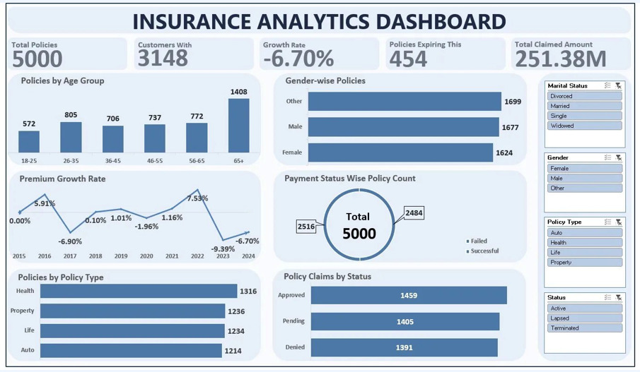
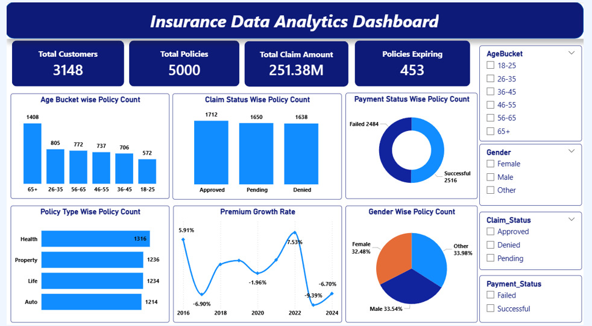
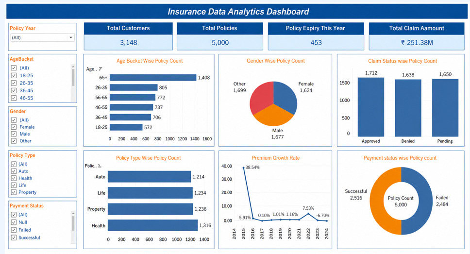

# Insurance Analytics Dashboard
## DA_P1251 | Group 2 | ExcelR

## Project Overview
End-to-end Insurance Analytics project analyzing 5,000 policy records.

## Tools Used
- Microsoft Excel
- MySQL 8.0
- Power BI Desktop
- Tableau Public

## Team Members
1. Ponnaboini Sumanth
2. Prateek T Jacob
3. Laxmi K
4. Suresh Vishnoi
5. Dabbugottu Maneesh

## KPIs Covered
1. Total Policies — 5,000
2. Total Customers — 3,148
3. Age Bucket Wise Policy Count
4. Gender Wise Policy Count
5. Policy Type Wise Count
6. Policies Expiring 2026 — 453
7. Premium Growth Rate
8. Claim Status Wise Count
9. Payment Status — 49.7% Failed
10. Total Claim Amount — Rs 251.38 Million

## Dashboard Preview

### Excel Dashboard

### Power BI Dashboard

### Tableau Dashboard

## Key Insights
- 49.7% payment failure rate — Critical risk
- Premium declining since 2022
- 65+ age group is largest segment
- 453 policies expiring in 2026
